# Stealthchanger Guide
## Introduction
It was difficult to figure out my stealthchanger build, so this is my attempt to help organize the workflow, options, and decisions needed.

I started with an initial LDO Voron 2.4 300 with Stealthburner toolhead running on CAN (SB2209 CAN RP2040 board), with a Rapido Ace hotend and Galileo2 Extruder. 

Plan is to move slowly to 4 toolheads, mostly dragonburner since it seems well supported by Stealthchanger already. I may also make one Dragonburner, one A4T, one Anthead, etc. to try them out and see how I like each one. 

This was originally written in October 2025.  Things change quickly, so it may or may not reflect the state of the art when you read it. 

What worked well for me was to do the following in this order:

1. Decide on what you want to do! Then be prepared to change your mind halfway through, and re-print some stuff, take everything apart, and do it again.
2. Order a bunch of parts.  Wait a week or two while reading and doing more planning.
3. Upgrade to CAN or USB toolhead board for primary toolhead if you don't already have it. 
2. Install CAN or USB distribution board and "backpack"
3. Install umbilical cable to primary toolhead (T0)
4. Install CNC shuttle and backplate for your toolhead
5. Get printer working again to print other parts.
6. Print door buffer (done anytime)
7. Install top hat (done anytime)
8. Install Docks for your toolhead (getting harder)
9. Build 2nd + toolheads, install with umbilicals.
10. Install Klipper-toolchanger-easy (KTE)
11. Configure KTE
12. Calibrate offsets
13. Calibrate dock locations
14. Add Additional toolheads and docks

## Main References
* [DraftShift Design Stealthchanger Wiki](https://github.com/DraftShift/StealthChanger/wiki)
  ** NOTE: The wiki is great, but the pages listed on the right are alphabetical, NOT in the order you should be working from. You should follow the order of the [Checklist page](https://github.com/DraftShift/StealthChanger/wiki/Checklist)!
* DraftShift Design Github Repositories
* UserMods for each Repo.
* Good [instructions from Cergs](https://github.com/EasterWorks/Cergs-Stealthchanger/blob/main/Hardware-And-Calibration.md) and background found here

As you go through deciding what to do, there are many options. and some decisions influence others. The order here is how I'd make decisions because of how everything is connected.
## Cable management
The Stealthchanger mounts a cable distribution board on the back of the printer, usually, using a "[Fanny Pack](https://github.com/DraftShift/CableManagement/blob/main/FannyPack/README.md)", but the documentation is a bit outdated or missing in places. 
 
I recommend the following:
<table>
	<tr><th>Fanny pack BOM</th><th>Notes</th></tr>
	<tr><td><a href="https://github.com/DraftShift/CableManagement/blob/main/FannyPack/STLs/base.stl">Fanny Pack Base</a> 
		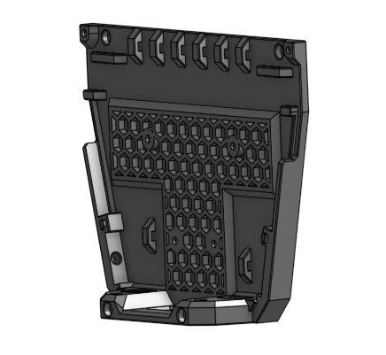</td>
		<td><ul><li>Only one option here</li>
			<li>This gets stuck to the back of your printer using VHB double-sided tape</li>
		</ul></td></tr>
	<tr><td><a href="https://github.com/DraftShift/CableManagement/tree/main/FannyPack/STLs/brackets/main">PCB Bracket</a> 
		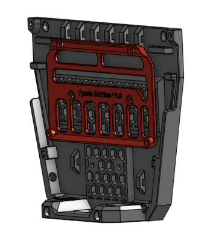</td>
		<td><ul><li>PCB Bracket for your board</li>
		</ul></td></tr>
	<tr><td><a href="https://github.com/DraftShift/CableManagement/tree/main/UserMods/N3MI-DG/Umbilical_plates_V2">Exhaust Plate</a> 
		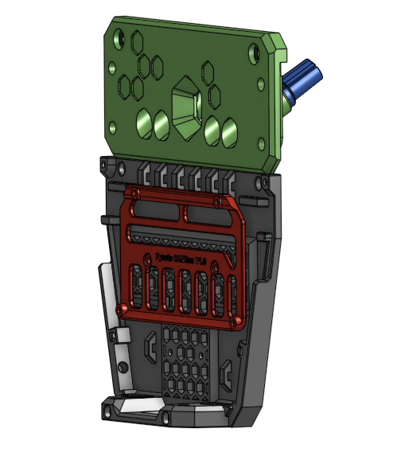</td>
		<td><ul><li>Use <a href="https://github.com/DraftShift/CableManagement/tree/main/UserMods/N3MI-DG/Umbilical_plates_V2">N3MI's Umbilical plate mod</a></li>
			<li>Pick the exhaust plate you want</li>
			<li>I used the TPU cable relief plugs and umbilical holders, and they worked well. There are also PG7 cable gland versions</li>
			<li>The flat 3mm spring steel is recommended over the piano wire</li>
			<li>Note the 3mm flat spring steel doesn't get screwed into the exhaust plate when using TPU cable relief.  It just wraps around the plug.</li>
			<li>There are SV08 versions in the user mods also</li>
			<li>I used the <a href="https://www.aliexpress.us/item/3256807340794999.html">Mellow 18AWG CAN cable, and was able to wire 2 toolheads with one cable length.
			<li>Since the cables are angled downward over the electronics, you can't use the
				<a href="https://github.com/DraftShift/CableManagement/blob/main/FannyPack/STLs/%5Ba%5D_sc_voron_cover.stl">Fanny Pack Cover</a> with this.</li>
		</ul></td></tr>
	<tr><td>Cable & tubing assembly </td>
		<td><ul><li>I used the <a href="https://www.aliexpress.us/item/3256807340794999.html">Mellow 18AWG CAN cable, and was able to wire 2 toolheads with one cable length.
		<li>This cable uses the 5.5mm TPU hole sizes on N3MI's cable relief parts.</li>
		<li>2.5mm ID, 4mm OD PTFE tubing (I was using 3mm ID tubing to my toolhead and was getting random filament not moving errors, but it could have been due to other factors also)</li>
		</ul></td></tr>
</table>

You need to be able to talk to all your toolheads. CAN bus is recommended. It seems USB is possible also with the Fystec Hexa Distro Fusion board. Pick one of these below.
<table>
	<tr><th>Distribution board</th><th>Notes</th></tr>
	<tr><td><a href="https://docs.ldomotors.com/en/Toolboard/Nitehawk-Hexa">LDO Nighthawk Hexa</a> 
		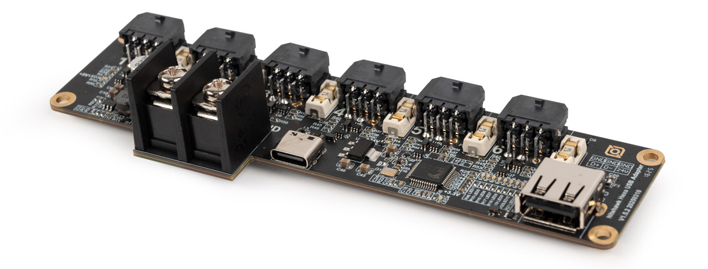</td>
		<td><ul><li>Comes in LDO kit</li>
			<li>CAN only</li>
		</ul></td></tr>
	<tr><td><a href="https://wiki.fysetc.com/docs/hexa_distro_fusion">Fystec hexa distro fusion</a> 
		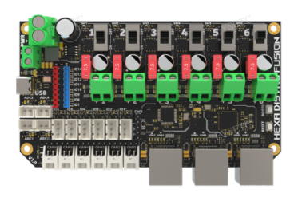</td>
		<td><ul><li>6 USB and CAN ports</li>
			<li>Extra fan ports & IOs</li>
		</ul></td></tr>
	<tr><td><a href="">Fystec CAN Distrobution board</a> 
		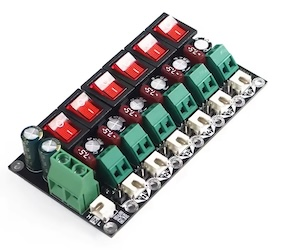</td><td><ul><li>Simplest of the three</li>
			<li>Just CAN distribution and power</li>
			<li>Cheapest option?</li>
			<li>Really bad documentation, <a href="https://github.com/FYSETC/Tool-Distribution-Board/blob/main/TBD%20Wiring.jpg">only one image for documentation</a>. Be careful with power polarity!</li>
		</ul></td></tr>
	<tr><td><a href="https://store.isiks.tech/products/birds-nest-can">Birds' nest CAN hub by Isik's Tech</a> 
		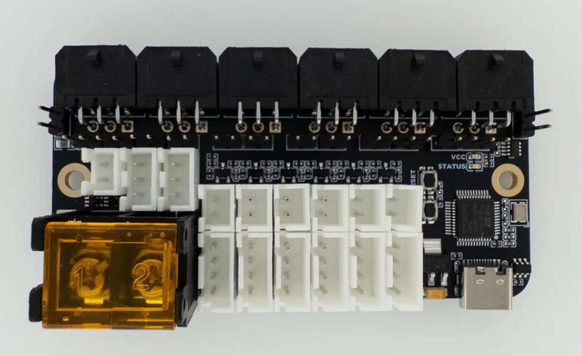</td>
		<td><ul><li>6 CAN ports</li>
			<li>6 filament sensor ports</li>
			<li>6 Thermistor ports</li>
			<li>Additional expansion ports</li>
			<li>2x 5V ARGB connectors</li>
		</ul></td></tr>
	<tr><td><a href="">USB-CAN board</a> </td><td>If needed, I used the Fystec USB-CAN board because my Octopus 1.1 didn't have CAN onboard, or it was hard to get working.  I tried the BTT CAN borad, but never got it to work.  The Fystec worked easily for me.</td></tr>
</table>
 

## Shuttle
This is the part that goes on your X carriage to mate and pickup each tool. It will mate with a BACKPLATE that's made specifically for your toolhead. See Toolheads & Backplates below.  
Print <a href="https://github.com/DraftShift/StealthChanger/tree/main/STLs/Extras/BeltHelper">BeltHelper</a> to help make this easier! 
See the excellent Draftshift <a href="https://github.com/DraftShift/StealthChanger/blob/main/Manual/Stealthchanger_Assembly_Guide.pdf">assembly guide</a> for instructions.
<table>
<tr><th>Shuttle Options</th><th>Details</th></tr>
<tr><td><a href="https://www.fysetc.com/products/fysetc-stealthchanger-cnc-shuttle-kit-sb-combo-v2-board-tool-distribution-board-h36-board?variant=44927105040559">Fystec CNC Shuttle</a> 
		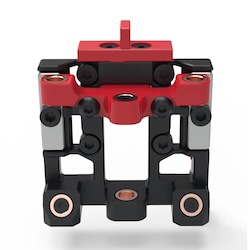</td><td>
			<ul><li>I have this one, and it works well</li>
			<li>It comes with pins, N52 magnets, and screws for 6 backplates also!</li>
			<li>No instructions are included, so you need to figure it out</li>
		</ul></td></tr>
<tr><td><a href="https://kb-3d.com/store/voron/6008-ldo-motors-stealth-changer-cnc-shuttle-kit-6975415159350.html">LDO Kit CNC Shuttle</a> 
		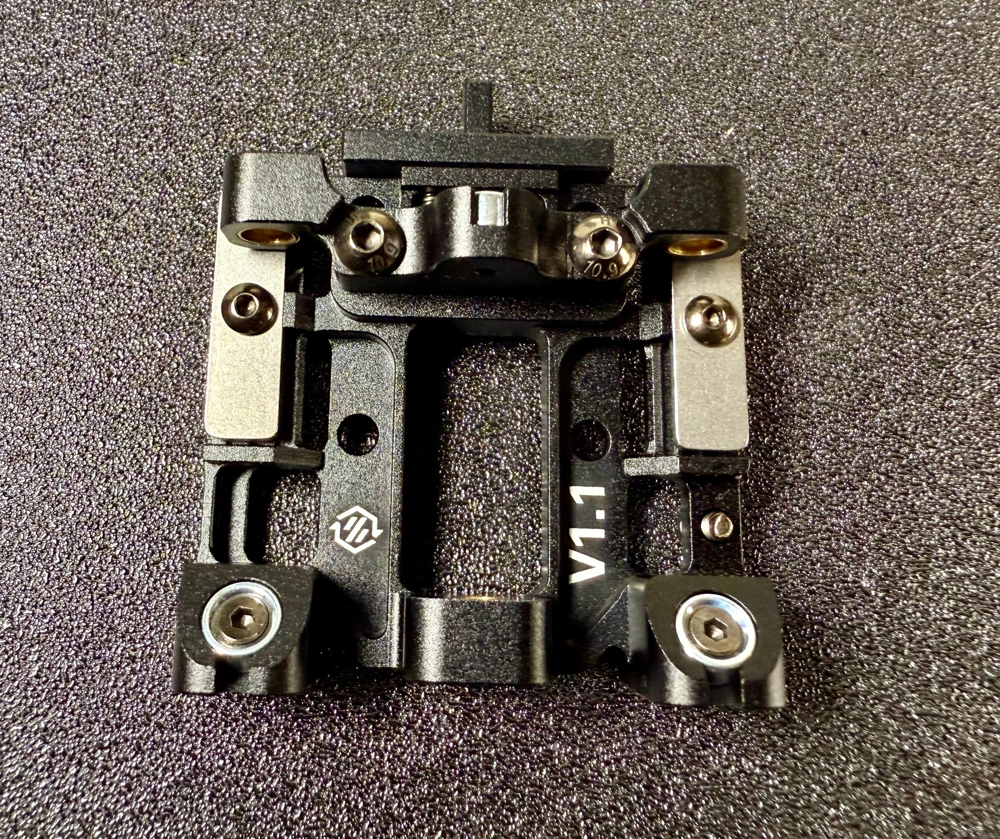</td><td>
			<ul><li>Not sure what comes with this kit; shuttle seems similar to the Fystec</li>
		</ul></td></tr>
<tr><td><a href="https://github.com/DraftShift/StealthChanger?tab=readme-ov-file">Print your own</a> 
		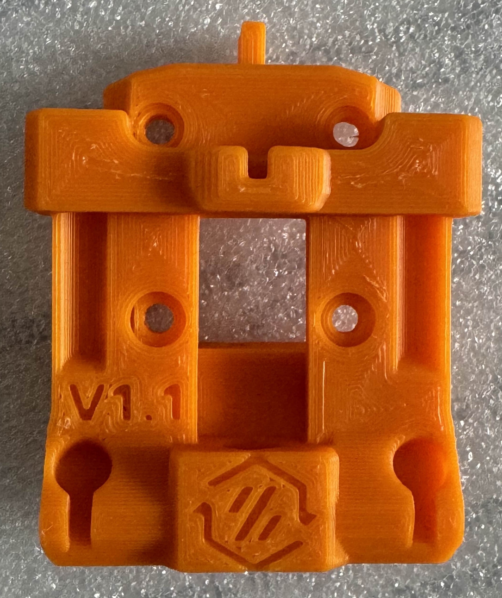</td><td>
			<ul><li>These are thicker so you loose a bit more Y in print volume, and they are more flexibile</li>
			<li>Just get a CNC shuttle!</li>
		</ul></td></tr>
</table>

## Crossbar, dock, and door buffer
A crossbar is recommended for stability, but there are options for how to mount it, and then that enables/disables other things.  You need to pick one of these options below.
 Essential information: <a href="https://github.com/DraftShift/ModularDock">Draftshift Modular Dock</a>
 Draftshift <a href="https://github.com/DraftShift/ModularDock/blob/main/Manual/ModularDock_Assembly_Guide.pdf">modular dock assembly guide.</a>
<table>
<tr><th>Crossbar options</th><th>Details</th></tr>
<tr><td>No crossbar / Top mount 
		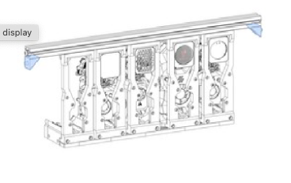</td><td>
			<ul><li>Least sturdy option</li>
			<li>Requires several printed braces & links to help stabilize the docks</li>
			<li>I haven't tried this, and don't see too many others doing it either</li>
			<li>No need for <a href="https://github.com/DraftShift/DoorBuffer">door buffer</a>?</li>
		</ul></td></tr>
	<tr><td>Crossbar mounted outside front extrusions 
		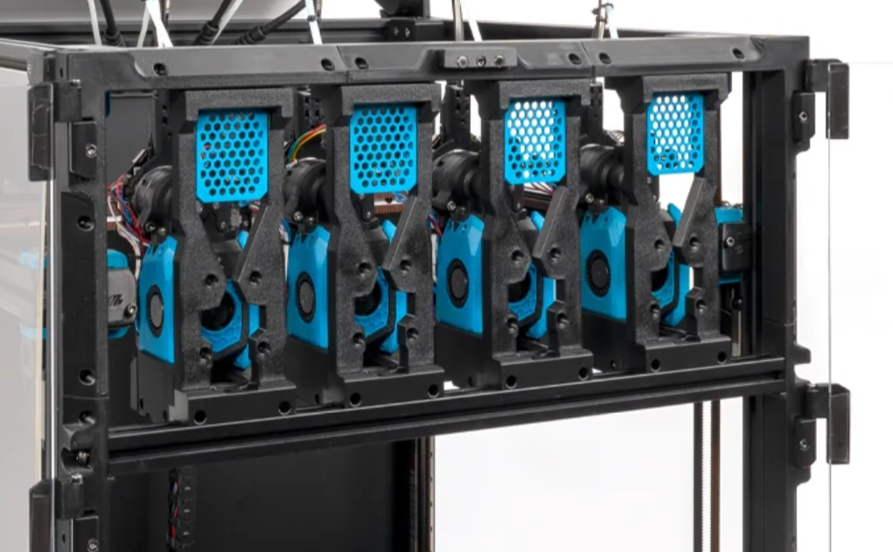</td><td>
			<ul><li>Probably the most common setup</li>
				<li>Strongest setup (least dock movement potential)</li>
			<li>Requires a <a href="https://github.com/DraftShift/DoorBuffer">door buffer</a> so your door will still have something flat on the front of the printer</li>
			<li>This option is what comes with the LDO kit</li>
		</ul></td></tr>
	<tr><td>Crossbar mounted <em>between</em> front extrusions 
		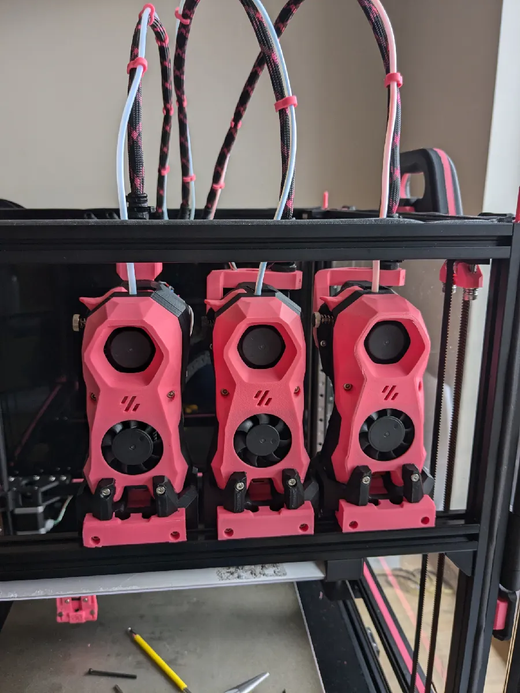</td><td>
			<ul><li>Needs tight bolts to keep from rotating</li>
			<li>Front idlers will hit the crossbar, so you need to change idlers to use the <a href="https://github.com/DraftShift/StealthChanger/tree/main/UserMods/BT123/MiniBFI%20%2B%20MicroBFI">MiniBFI</a>.
			<li>No need for <a href="https://github.com/DraftShift/DoorBuffer">door buffer</a></li>
			<li>20mm less Y build space unless you use shorter "stubby" docks.  Even with stubby docks, I think the Y build space is 10mm less than the outside-mounted crossbar</li>
			<li>Image from @drakarah and <a href="https://www.printables.com/model/994635-stealthchanger-stealthburner-minimal-docks-aka-hap/comments">Happy Crab Docks</a></li>
		</ul></td></tr>
</table>

## Door Buffer
TBD

## Toolheads & Docks (needs more work)
People seem to like smaller toolheads for Stealthchanger because you can fit more in the space you're using. You may build a dock for your existing toolhead (I had a Stealthburner), and then built new toolheads as other types. You can mix and match, but the configs get more complicated because you need to have different ones for each toolhead. For me, you need to calibrate each toolhead anyway, so it seems a good opportunity to try different toolheads. The list here is just the options I'm interested in.  StealthChanger supports other toolheads also! 
 Note that toolheads go hand-in-hand with their associated docks, and the options/mods available for them. 

<table>
<tr><th>Components</th><th>Details</th></tr>
<tr><td valign=top><strong><a href="https://github.com/PrintersForAnts/AntHead/tree/main">AntHead 
	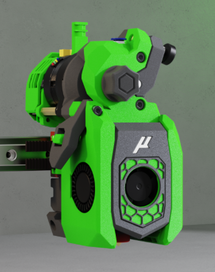</a></strong></td>
	<td valign=top><ul><li>Seems popular and modern.</li>
		<li>Uses 60mm wide docks. Can use stubby docks?</li>
	</ul></td></tr>
	
<tr>
	<td valign=top><strong><a href="https://github.com/Armchair-Heavy-Industries/A4T?tab=readme-ov-file">A4T 
	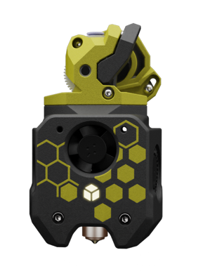</a></strong>
	</td>
	<td valign=top><ul><li>Slightly less supported with mods, but performance is supposed to be good.</li>
	<li>Requires Shorter Z joints like <a href="https://github.com/VoronDesign/VoronUsers/tree/main/printer_mods/hartk1213/Voron2.4_GE5C">Ge5C z-joints</a> so you don't bottom out your carriage when homing.</li>
		<li>Requires new smaller front idlers like the <a href="https://github.com/clee/VoronBFI">BFI</a> or <a href="https://github.com/DraftShift/StealthChanger/tree/main/UserMods/BT123/MiniBFI%20%2B%20MicroBFI">Mini BFI</a></li>
	</ul></td></tr>
	
<tr>
	<td valign=top><strong><a href="https://github.com/chirpy2605/voron/tree/main/V0/Dragon_Burner">Dragonburner </a></strong>
	</td>
	<td valign=top><ul><li>Uses 60mm wide docks. Can use stubby docks. </li>
	<li><a href="https://github.com/bigtreetech/EBB/blob/master/EBB%20CAN%20V1.1%20and%20V1.2%20(STM32G0B1)/EBB36%20CAN%20V1.1%20and%20V1.2/Hardware/EBB36%20CAN%20V1.1%26V1.2-PIN.png">EBB36 CAN Toolhead Board</a>, using UserMod <a href="https://github.com/DraftShift/StealthChanger/tree/main/UserMods/TheSin-/PCB36_Mount">TheSin PCB36 Mount</a></li>
		<li><a href="https://www.printables.com/model/1440113-m3-heatset-standoffs-10mm-30mm">22mm standoffs</a> to mount the toolhead board to Orbiter 2 extruder</li>
		<li><a href="https://discord.com/channels/1226846451028725821/1320029517376655462/1347878802751230005">Magnetic dock</a> for Dragonburner, Discord only</li>
	<li><a href="https://github.com/DraftShift/StealthChanger/tree/main/UserMods/traxman25">Dragonburner numbered cowls</a> (not compatible with magnetic bases)</li>
	</ul></td></tr>
	
<tr>
	<td valign=top><strong><a href="https://github.com/VoronDesign/Voron-Stealthburner">Stealthburner 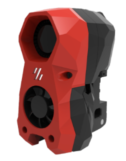</a></strong>
	</td>
	<td valign=top><ul><li>Can work fine. Needs 76mm wide dock. Docking is a bit harder, but mine seems fine. Needs work on umbilical attachment for 3mm spring steel umbuilical from N3MI.</li>
		<li>Recommend the <a href="https://www.printables.com/model/1384948-stealthchanger-stealthburner-backplate-v11-magnet">screw-in backplate mod</a> for better 4mm pin positioning</li>
		<li>and magnetic backplate (same file above) for better control of stealthburner on dock.</li>
		<li><a href="https://www.printables.com/model/994635-stealthchanger-stealthburner-minimal-docks-aka-hap">Happy Crab Docks</a></li>
		<li><a href="https://www.printables.com/model/1358108-stealtchanger-stealthburner-backplate-with-screwed/comments">Screwed pins backplate</a></li>
		</ul></td></tr>
</table>

# Below here needs more work...

Toolhead PCBs:  
For EBB36 / Nighthawk 36 / 
https://github.com/jwellman80/VoronMods/tree/main/EBB36%20Umbilical%20Clip%20Mount

## Docking Method
<table>
<tr><th>Components</th><th>Details</th><th>Options</th></tr>
<tr>
	<tr>
	<td valign=top> 
	</td>
	<td valign=top>
	</td>
	<td valign=top>
	</td></tr>
</tr>

## Software & Calibration
Sounds like I should use "Klipper-toolchanger-easy" instead of the default repo.  
* https://github.com/jwellman80/klipper-toolchanger-easy?tab=readme-ov-file
* Even when using klipper-toolchanger-easy, use the examples in the [Draftshift Klipper-toolchanger folder](https://github.com/DraftShift/klipper-toolchanger)
* Klipper-toolchanger-easy is just for installation.  After installing that, still follow the [stealthchanger wiki](https://github.com/DraftShift/StealthChanger/wiki/Calibration) for configuration and setup!
* Nudge XY calibration
* [Dock Tuner macro]((https://github.com/Contomo/klipper-toolchanger-hard/blob/main/examples/dock%20location/fixed/dock_tuner.cfg)  how to install?
* LEDs: [Example from Draftshift](https://github.com/DraftShift/klipper-toolchanger?tab=readme-ov-file) designs page
* [LED Effects](https://github.com/julianschill/klipper-led_effect) TBD

SW Setup issues:
* if using "fan0 or fan2" from slicer, need to change those back to named fans.

## Calibration !!
I found that the default instructions on the Draftshift wiki were wrong. I started with 1 Stealthburner as T0, and 1 Dragonburner as T1.  Assumed all the calibration would allow for this, but after three days of frustration, here's my learnings:
1. If you home with T1, Anytime the gcode_offsets change for T>0, the dock positions need to be updated.
2. When you get your T1 dock positions,M114 reports the gcode positions. That is, the raw machine position with any gcode_offsets and probe_offsets.  I found that I needed to use the raw machine position in my dock locations set in params_park_x,y,z.  This means using my Fluidd-reported location without offsets, NOT M114 locations, which include all the offsets.
3. When people use the same toolhead for all their tools, they don't notice this difference because each tool's gcode_offset_x,y is near zero.
4. Another way to get around this difficulty would be to home with T0 (no gcode or probe offsets!), and then, when putting T1 on, DON'T initialize_toolchanger.  This should (to be verified) keep the machine coordinates.
5. FYI, because initialize_toolchanger applies the probe and gcode_offsets, this is a feature, not a bug. This allows you to home with any tool, and the dock locations will be the same.

## Setup & Slicing
How to handle the build area loss from the docks? 

## Other
* [Stealthchanger plate image generator](https://jsfiddle.net/ng3Lawyb/).  This shows where to print short objects so you don't loose too much area in the front!

* TBD: [Filament runout](https://github.com/DraftShift/StealthChanger/tree/main/UserMods/RNGIllSkillz/IllFilamentRunout)

